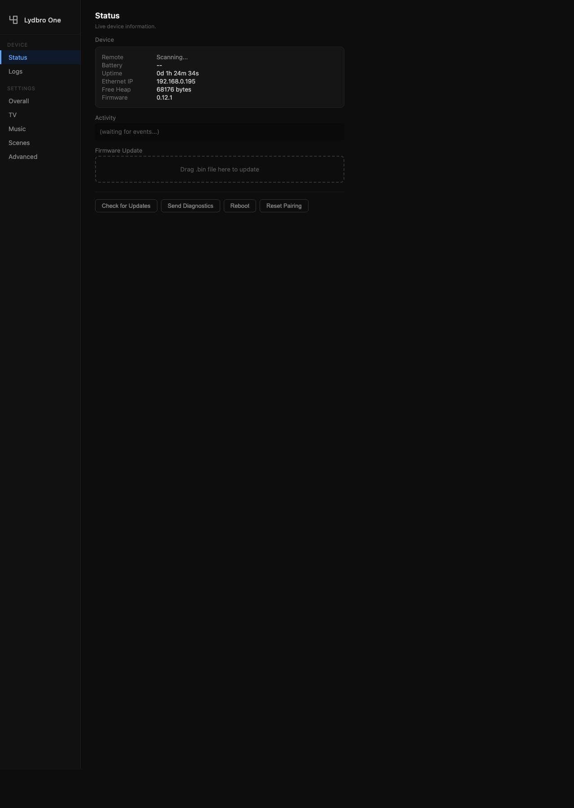

<p align="center">
  
</p>

<h1 align="center">Lydbro for Home Assistant</h1>

<p align="center">
  <a href="https://github.com/hacs/integration"></a>
  <a href="https://github.com/mkirsten/lydbro-hass/actions/workflows/validate.yml"></a>
  <a href="https://github.com/mkirsten/lydbro-hass/releases"></a>
  <a href="https://developers.home-assistant.io/docs/core/integration-quality-scale"></a>
</p>

Native Home Assistant integration for [Lydbro](https://lydbro.com) devices —
control and automate your Bang & Olufsen BeoRemote One through a **Lydbro One**
bridge.

Local, push-based, no cloud, no polling, no YAML required. Declared
against Home Assistant's integration quality scale at **Platinum** —
the full quality bar including Bronze setup, Silver reliability, Gold
UX and Platinum strict typing + async purity — and backed by a
[100% covered](https://github.com/mkirsten/lydbro-hass/actions/workflows/validate.yml)
test suite that runs the real client code against a fake bridge
over loopback on every push.

## Contents

- [What this integration gives you](#what-this-integration-gives-you)
  - [Entities](#entities-per-lydbro-one-device)
  - [Device triggers](#device-triggers)
  - [Services](#services)
  - [How data arrives](#how-data-arrives)
  - [Common use cases](#common-use-cases)
- [Supported devices](#supported-devices)
- [Installation](#installation)
- [Requirements](#requirements)
- [Automation examples](#automation-examples)
- [Repair notifications](#repair-notifications)
- [Diagnostics](#diagnostics)
- [Troubleshooting](#troubleshooting)
- [Known limitations](#known-limitations)
- [Protocol reference](#protocol-reference)
- [Migrating from MQTT](#migrating-from-mqtt)
- [License](#license)

---

## What this integration gives you

The moment you press a button on your BeoRemote One, Home Assistant knows
about it. Latency is on the order of the TCP round-trip on your LAN —
typically under 50 ms. Events arrive over a single persistent TCP
connection; commands flow back through the same socket.

### Entities (per Lydbro One device)

**Enabled by default:**

| Platform | Entity | Notes |
|---|---|---|
| `event` | **Button** | Fires on every physical press. `event_type` is the button name (`Play`, `Next`, `Home`…); `kind` (`click` / `hold` / `release` / `double`) and `mode` (`MUSIC` / `TV` / …) come through as attributes. |
| `event` | **Menu** | Fires when the user picks an item from the remote's vendor menu. `name` and `source` identify the menu and item. |
| `event` | **Scene** | Fires when one of the four corner scene buttons is pressed. `event_type` is the physical position: `top_left`, `top_right`, `bottom_left`, `bottom_right`. |
| `sensor` | BeoRemote battery | Battery % of the paired BeoRemote One (device class `battery`). |
| `sensor` | Boot phase | Diagnostic — what the bridge is doing during startup. |
| `sensor` | Firmware | Reported firmware version of the bridge. |
| `binary_sensor` | BeoRemote link | `connectivity` — is a BeoRemote currently paired over BLE. |
| `binary_sensor` | Ethernet | Diagnostic. |
| `binary_sensor` | Safe mode | `problem` — fires if the bridge has entered crash-loop safe mode. |
| `button` | Reboot | Reboot the bridge. |
| `button` | Rescan discovery | Trigger an mDNS rescan for Sonos / TVs / HA on the LAN. |
| `button` | Disconnect BeoRemote | Drop the BLE link and re-pair. |
| `remote` | BeoRemote | Virtual remote — `remote.send_command` fires a BeoRemote key press without needing the physical remote. `is_on` tracks the BLE link. |

**Disabled by default** — enable the ones you need from the device
page in HA. They're off by default so the device card stays
uncluttered for users who drive everything from automations and
don't need dashboard wiring:

| Platform | Entity | Notes |
|---|---|---|
| `sensor` | Last button press | Timestamp (`device_class: timestamp`) of the most recent BeoRemote press, with `name` / `kind` / `mode` as attributes. Perfect for a "last activity" card. |
| `sensor` | Current mode | Enum (`music` / `tv` / `radio` / `homemedia` / `games` / `control`). Tracks whichever mode the remote was last observed in. Good for dashboard conditionals — show different cards based on what the user is doing. |
| `sensor` | IP address | Diagnostic — the bridge's LAN address, for when you need to open its web UI from an automation. |
| `button` | Play / Pause / Next / Fast Forward / Rewind / Volume Up / Volume Down / Mute / Power / Up / Down / Left / Right / Select / Menu / Back / Home / Info / Guide / Music / TV / List / Channel Up / Channel Down / Red / Green / Yellow / Blue / 0–9 | One virtual remote-key button per canonical BeoRemote One event. Pressing each fires `send_remote_key` with the matching key, so you can drag e.g. **Play** onto a Lovelace card without scripting. |

### Device triggers

Every button × kind combination and every scene position is registered
as a Home Assistant **device trigger**, so the automation editor shows a
point-and-click dropdown for each bridge:

> Device: *Lab Beoremote One* → Trigger type: *Play button (held)*

No YAML required for the common cases. Under the hood each device
trigger wraps a `lydbro_button` / `lydbro_scene` / `lydbro_menu` bus
event with the right filters.

### Services

For the things that benefit from structured arguments, the integration
also registers a set of services. All of them take a `device_id` so you
can target a specific bridge when you run more than one:

- `lydbro.send_remote_key` — inject a virtual BeoRemote key press

Bridge-level admin actions (**Reboot**, **Reset BeoRemote
pairing**, **Disconnect BeoRemote**) are exposed as `button`
entities on the device page rather than services — they're one-off
actions, not automation inputs.

The integration deliberately does **not** expose TV / Sonos control
services. The Lydbro One is a bridge *from* the BeoRemote to Sonos /
TVs / HA — Home Assistant already talks to Sonos and your TV
directly, so routing those commands through the ESP32 would be a
detour with no upside. Drive Sonos and TVs from their own HA
integrations.

There is also no rescan-discovery action: the bridge rescans the
LAN on every boot, so pressing **Reboot** gives you a fresh device
list for free.

### How data arrives

This is a **push integration**. Events arrive over a persistent TCP
connection that the integration holds open to the bridge — there is
no polling, no `scan_interval` to tune, and no "update every N
seconds" knob anywhere. When you press a button, the bridge pushes a
frame, the coordinator forwards it to the right entity, and your
automation runs. Round-trip is bounded by your LAN latency.

If the TCP link drops (device reboot, Ethernet flap, power cycle) the
client reconnects automatically with exponential backoff. Entities
drop to `unavailable` until the first state snapshot arrives on the
new connection.

### Common use cases

What people actually build with this:

- **BeoRemote One → Sonos**. Play / Pause / Next / Rewind / Vol
  Up / Vol Down mapped to the currently-selected Sonos zone. The
  bundled [`blueprints/beoremote_media_player.yaml`](blueprints/beoremote_media_player.yaml)
  wires this up in one click.
- **BeoRemote One → Samsung Frame TV**. In `TV` mode the bridge
  drives the Frame directly (Tizen WebSocket from the ESP32); in
  `MUSIC` mode the same buttons drive Sonos instead. Both paths run
  on the device — HA just sees the resulting button events.
- **Corner scene buttons → light scenes**. The four corner
  "scene" buttons on the BeoRemote trigger four different Home
  Assistant scenes, good for "movie mode" / "reading" / "party" /
  "off".
- **Ambient automation triggers**. Low battery, BLE disconnect,
  safe mode — all surface as device diagnostics + repair
  notifications, so you get a heads-up without watching logs.

See [`examples/automation-beoremote-control.yaml`](examples/automation-beoremote-control.yaml)
for a worked end-to-end example that's driving a real setup in the
wild.

---

## Supported devices

| Device | Firmware | Status |
|---|---|---|
| **Lydbro One** | ≥ `0.11.9.3` | Fully supported (active development target) |

The Lydbro One is the ESP32-based bridge with PoE Ethernet + BLE
that pairs with a Bang & Olufsen BeoRemote One — the Bluetooth remote
B&O ships with Beolink Multiroom, Beosound and Beovision products, and
a popular upgrade for owners of older Beolink / Masterlink era systems
who want their B&O remote driving the rest of the smart home. Earlier
Raspberry Pi / BlueZ builds (pre-ESP32) are not supported by this
integration — they predate the Native TCP transport. If you're on one of those,
the legacy MQTT path still works and there's a migration guide
linked below.

Only the **Native TCP v1** transport is wired up. If the bridge's
config UI has *HA integration* set to MQTT or Webhook, flip it to
Native TCP before adding the integration. Native TCP must be enabled
on the device for the integration to connect at all.

### The bridge's web UI

The Lydbro One serves a built-in config UI at `http://<bridge-ip>/`
that's the source of truth for per-bridge settings: which HA
transport to use, Samsung / LG TV pairing, Sonos config, scene-button
bindings, and firmware updates. You don't normally need to touch it
after initial setup — zeroconf discovery will hand HA the right
address and Native TCP will populate the rest — but it's where you
go when something is off.

<p align="center">
  
</p>

---

## Installation

### Via HACS (recommended)

1. In HACS → **Integrations** → ⋮ → **Custom repositories**
2. Add `https://github.com/mkirsten/lydbro-hass` as category **Integration**
3. Install **Lydbro**
4. Restart Home Assistant
5. Your Lydbro One should pop up under **Settings → Devices & Services →
   Discovered**. If it doesn't, add it manually via **+ Add Integration →
   Lydbro** and enter its IP.

### Manually

1. Copy `custom_components/lydbro/` into your HA `config/custom_components/`
2. Restart Home Assistant
3. Add the integration from **Settings → Devices & Services**

### Changing the bridge's address

DHCP occasionally moves the bridge between reboots. Rather than
deleting and re-adding the integration (which would orphan any
automations keyed to the device's registry id), use **Settings →
Devices & Services → Lydbro → ⋮ → Reconfigure** to update the host
or port in place. The flow re-probes the new address and refuses
to point the existing entry at a different physical bridge — safe
to run even if you misremember where the device moved to.

### Removing the integration

1. **Settings → Devices & Services → Lydbro**, click the three-dot
   menu on your bridge entry and choose **Delete**. This removes the
   config entry, tears down the TCP connection, and unregisters all
   entities, services, and device triggers for that bridge.
2. If you installed via HACS and want to remove the integration
   entirely, go to **HACS → Integrations → Lydbro → ⋮ → Remove** and
   restart Home Assistant.
3. Any automations that referenced the deleted entities or device
   triggers will show up in **Settings → Automations** as
   *Unavailable* — update or delete them.

The integration doesn't write anything outside HA's own config
directory, so removing the entry leaves no stray state behind.

---

## Requirements

- **Home Assistant 2024.12 or newer.** The integration uses
  `entry.runtime_data` (2024.4+), `quality_scale` in the manifest
  (2024.12+), and strict-typed async patterns that depend on HA's
  2024-era helpers. It's tested against 2026.2 in CI and deployed
  against 2026.4 in the field; a clean slate on 2024.12 should
  work but isn't actively exercised.
- **Python 3.13 or newer** on the HA side — already satisfied by
  any modern HA install.
- **A Lydbro One bridge** on firmware ≥ `0.12.3` with the Native
  TCP v1 transport selected. The bridge's config UI at
  `http://<bridge-ip>/` must have *HA integration → Native TCP* on
  — this integration does not speak MQTT or Webhook and won't
  connect to a bridge in the other modes.

### Compatibility

The hard compatibility gate is the **Native TCP protocol version**
announced in the bridge's `hello` frame. This integration refuses
to connect if the versions disagree, so a mismatched pair fails
fast with a readable error rather than silently garbling events.

| lydbro-hass | Lydbro One FW | Protocol |
|-------------|---------------|----------|
| 0.2.x       | 0.13.0+       | v2       |
| 0.1.x       | 0.11.9.3 – 0.12.4 | v1   |

Firmware versions outside a range in the table *may* still work
since v1 is additive, but haven't been exercised together — if
you hit something weird, upgrade both sides to the same row.

---

## Automation examples

### "Play" button on the BeoRemote → resume Sonos

Simple event-entity trigger. No kind filter, so this fires on clicks,
holds and doubles alike:

```yaml
automation:
  - alias: BeoRemote Play resumes Sonos
    triggers:
      - trigger: state
        entity_id: event.lab_beoremote_one_button
        attribute: event_type
        to: "Play"
    actions:
      - action: media_player.media_play
        target:
          entity_id: media_player.living_room
```

### Hold the Red button → "good night" script

For kind-sensitive triggers, listen to the `lydbro_button` bus event
directly so you can filter on `kind` in `event_data`:

```yaml
automation:
  - alias: BeoRemote Red hold → good night
    triggers:
      - trigger: event
        event_type: lydbro_button
        event_data:
          name: Red
          kind: hold
    actions:
      - action: script.good_night
```

### Scene corner button → scene activation

Four positions: `top_left`, `top_right`, `bottom_left`, `bottom_right`.
You can trigger on the event entity's attribute, or — for a nicer
editor experience — pick the device trigger *Scene: top_left* from the
Automations UI:

```yaml
automation:
  - alias: BeoRemote top-left scene → movie mode
    triggers:
      - trigger: state
        entity_id: event.lab_beoremote_one_scene
        attribute: event_type
        to: "top_left"
    actions:
      - action: scene.turn_on
        target:
          entity_id: scene.movie_mode
```

A full worked example — porting a real MQTT automation to the native
transport, including TV menu dispatch, Samsung key mapping and corner
scenes — lives in [`examples/automation-beoremote-control.yaml`](examples/automation-beoremote-control.yaml).

---

## Repair notifications

The integration raises a handful of HA repair issues automatically
when something is wrong — they show up in **Settings → Repairs**
and clear themselves the moment the condition recovers. No
dashboards or automations needed:

- **Safe mode** (severity `error`) — the bridge rebooted into safe
  mode after repeated crashes. The notification includes a link to
  the bridge's web UI so you can fix the configuration and reboot.
- **Low battery** (severity `warning`) — the paired BeoRemote One
  is at or below 10%. Hysteresis: the notification clears once the
  battery recovers past 15%, so a remote bouncing around the
  threshold doesn't flap the notification on and off.

---

## Diagnostics

On the device page in HA, the **Download Diagnostics** button
produces a JSON dump of the live coordinator state — the hello
frame, the current state snapshot, and the connection bookkeeping.
Attach that to a bug report instead of copy-pasting from logs;
there's nothing sensitive in it (no credentials, no tokens, just
LAN IPs of discovered Sonos / TVs) so you don't need to redact.

---

## Troubleshooting

- **Integration loads but stays "unavailable"** — verify the bridge has
  the **Native TCP** transport selected in its config UI at
  `http://<bridge-ip>/`. If it's set to MQTT or Webhook, the native TCP
  server is torn down and this integration can't connect.
- **No buttons triggering** — check the `event.lab_beoremote_one_button`
  entity in **Developer Tools → States**. Press a button on the remote;
  the state (last-fired timestamp) and `event_type` attribute should
  update within a second. If they don't, the bridge isn't receiving BLE
  events — debug on the device itself.
- **Bridge moved to a new IP** — use **Reconfigure** on the device
  card (see *Changing the bridge's address* under Installation)
  rather than deleting and re-adding. Reconfigure preserves the
  device registry id, so any automations keyed to it keep working.
- **Enabling debug logs** — add to `configuration.yaml`:
  ```yaml
  logger:
    logs:
      custom_components.lydbro: debug
  ```
- **Filing a bug** — grab **Download Diagnostics** from the device
  page (see above) and attach it to the issue. That's the fastest
  path to a diagnosis.

---

## Known limitations

- **Events drop under extreme burst load.** The bridge's Native TCP
  server keeps an 8-frame outbound queue per client. If the client
  can't drain it fast enough (e.g. HA is pegged), the oldest frames
  are dropped rather than growing the queue unbounded. In normal
  use this is never hit — button presses are orders of magnitude
  slower than the drain rate — but if you are generating synthetic
  floods for testing, expect losses beyond 8 in-flight frames.
- **Idle timeout is 30 seconds.** The server drops clients that go
  silent for more than 30 s in both directions. The client pings
  every 8 s to stay ahead of it, so in practice this only shows up
  if the network itself stalls for that long — in which case the
  auto-reconnect loop picks it back up on the next attempt.
- **Zeroconf discovery is LAN-scoped.** The bridge advertises
  `_lydbro._tcp.local.`, which only propagates within a broadcast
  domain. If Home Assistant and the bridge live on different VLANs
  / subnets, auto-discovery won't find the bridge — add it
  manually by IP via **+ Add Integration → Lydbro** and the flow
  will probe it the same way.
- **BLE is single-remote.** The Lydbro One pairs with exactly one
  BeoRemote One at a time. Running two remotes into one bridge
  isn't a software limitation this integration can fix — it's a
  bridge-side constraint.
- **No translation beyond English yet.** The entity, error and
  repair-issue strings ship in English. Swedish / Danish
  translations are on the roadmap (the Lydbro home turf).

---

## Protocol reference

The integration speaks **Lydbro Native TCP v1**: persistent line-delimited
JSON over TCP port 6204.

- Server sends a `hello` frame on connect (`{t, v, fw, branch, id, name, caps}`)
- Client replies with `hello_ack`
- Server pushes an initial `state` snapshot, then streams `event` frames
- Commands travel client → server as `cmd` frames with a client-chosen `id`;
  server replies with a matching `result` frame
- Keepalive: `ping` / `pong` every 10 s while idle, 30 s silent drop

Event types emitted: `button_press`, `button_release`, `menu_selection`,
`scene_button`, `state_change`, `boot_phase`.

Discovery: mDNS `_lydbro._tcp` with TXT records `id`, `model`, `version`,
`name`, `proto_v`.

---

## Migrating from MQTT

If you previously drove Home Assistant automations off the
`lydbro-one/out` MQTT topic, see
[`docs/MIGRATING_FROM_MQTT.md`](docs/MIGRATING_FROM_MQTT.md) for the
field-by-field mapping and a template conversion guide.

---

## License

MIT — see [LICENSE](LICENSE).
